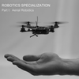

```
Roberto Nogueira  BSd EE, MSd CE
Solution Integrator Experienced - Certified by Ericsson
```
# Robotics Specialisation

## Robotics Aerial Robotics



**About the Course**

How can we create agile micro aerial vehicles that are able to operate autonomously in cluttered indoor and outdoor environments?  You will gain an introduction to the mechanics of flight and the design of quadrotor flying robots and will be able to develop dynamic models, derive controllers, and synthesize planners for operating in three dimensional environments.  You will be exposed to the challenges of using noisy sensors for localization and maneuvering in complex, three-dimensional environments.  Finally, you will gain insights through seeing real world examples of the possible applications and challenges for the rapidly-growing drone industry.

Mathematical prerequisites: Students taking this course are expected to have some familiarity linear algebra, single variable calculus, and differential equations

Programming prerequisites: Some experience programming with MATLAB or Octave is recommended (we will use MATLAB in this course.)

## Table of Contents

```
Syllabus

Week 1
Introduction to Aerial Robotics
[x] Video · Unmanned Aerial Vehicles
[x] Video · Quadrotors
[x] Video · Key Components of Autonomous Flight
[x] Video · State Estimation
[x] Video · Applications
[  ] Quiz · 1.1

[  ] Video · Meet the TAs
[  ] Reading · Setting up your Matlab programming environment
[  ] Reading · Matlab Tutorials - Introduction to the Matlab Environment
[  ] Reading · Matlab Tutorials - Programming Basics
[  ] Reading · Matlab Tutorials - Advanced Tools
[  ] Video · Basic Mechanics
[  ] Video · Dynamics and 1-D Linear Control
[  ] Video · Design Considerations
[  ] Video · Design Considerations (continued)
[  ] Video · Agility and Maneuverability
[  ] Video · Component Selection
[  ] Video · Effects of Size
[  ] Quiz · 1.2

[  ] Video · Supplementary Material: Introduction
[  ] Video · Supplementary Material: Dynamical Systems
[  ]Video · Supplementary Material: Rates of Convergence

Week 2
[  ] Geometry and Mechanics

Week 3
[  ] Planning and Control

Week 4
[  ] Advanced Topics
```
